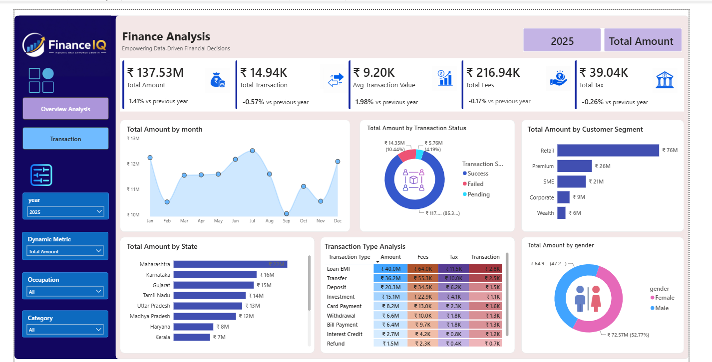
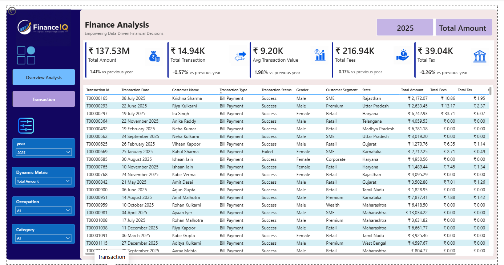

# FinanceIQ - Financial Analysis Dashboard

## 📌 Project Overview
This Power BI dashboard was developed to help a financial organization monitor and analyze financial transactions, customer behavior, fees, taxes, and transaction performance. It provides interactive reports that support better business decisions through real-time insights.

## 🎯 Business Objectives
- Monitor overall financial performance
- Analyze monthly transaction trends
- Compare transaction status (Success, Failed, Pending)
- Identify top customer segments
- Analyze state-wise performance
- Track transaction fees and taxes
- Monitor Year-over-Year (YoY) KPI changes

## 🛠️ Tools & Technologies
- Power BI
- Power Query
- DAX
- Excel

## 📊 Dashboard Features
### Dashboard 1 – Finance Overview
- KPI Cards
- Monthly Transaction Trend
- Transaction Status Analysis
- Customer Segment Analysis
- State-wise Analysis
- Transaction Type Matrix
- Gender Analysis
- Dynamic Filters (Year, Occupation, Category, Dynamic Metric)

### Dashboard 2 – Transaction Details
- Detailed transaction records
- Drill-through analysis
- Interactive filtering

## 📸 Dashboard Preview

### Overview Dashboard

### Transaction Dashboard

## 🚀 Skills Demonstrated
- Data Cleaning
- Data Modeling
- DAX Measures
- Power Query
- Dashboard Design
- Business Intelligence
- Data Visualization

## 👤 Author
**Rameshwar Kawade**
